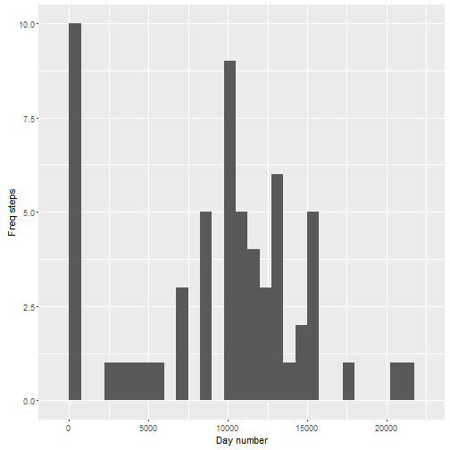
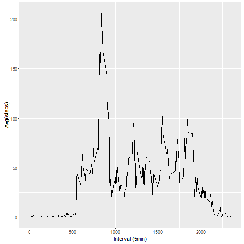
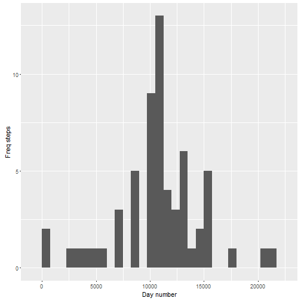

###Reproducible Research: Peer Assessment 1


##1. code for reading in the dataset

```r
if(!file.exists('activity.csv')){
    unzip('repdata-data-activity.zip')
}
activity_data <- read.csv('activity.csv')
```

##2.Histogram of the total number of steps taken each day

```r
activity_step_day <- tapply(activity_data$steps, activity_data$date,sum, na.rm=TRUE)
qplot(activity_step_day,xlab="Day number",ylab="Freq steps", binwidth=750)
```

 

##3.Mean and median number of steps taken each day

```r
mean_day <- mean(activity_step_day)
median_day <- median(activity_step_day)
```
### Mean is 9354.2295082 | Median is 10395

##4.Time series plot of the average number of steps taken

```r
avgStepsPerInterval <- aggregate(x=list(mean_to_steps=activity_data$steps), by=list(interval=activity_data$interval), FUN=mean, na.rm=TRUE)
g <-ggplot(data=avgStepsPerInterval, aes(x=interval, y=mean_to_steps)) +
  geom_line() +
  xlab("Interval (5min)") +
  ylab("Avg(steps)")
print(g)
```

 

##5.The 5-minute interval that, on average, contains the maximum number of steps

```r
maxmean <-which.max(avgStepsPerInterval$mean_to_steps)
maxmeaninterval <- avgStepsPerInterval[maxmean,'interval']
time_interval <- gsub("([0-9]{1,2})([0-9]{2})", "\\1:\\2",maxmeaninterval)
```

### Interval is 8:35

##6.Code to describe and show a strategy for imputing missing data

```r
activity_data_imputed <- activity_data
activity_data_imputed$steps <- impute(activity_data$steps,fun=mean)
```

##7.Histogram of the total number of steps taken each day after missing values are imputed

```r
activity_step_day_imputed <- tapply(activity_data_imputed$steps, activity_data_imputed$date,sum, na.rm=TRUE)
qplot(activity_step_day_imputed,xlab="Day number",ylab="Freq steps",binwidth=750)
```

 

##8.Panel plot comparing the average number of steps taken per 5-minute interval across weekdays and weekends

```r
activity_data_imputed$week_day <-  ifelse(as.POSIXlt(activity_data_imputed$date)$wday %in% c(0,6), 'weekend', 'weekday')
averagedActivityDataImputed <- aggregate(steps ~ interval + week_day, data=activity_data_imputed, mean)
gg<-ggplot(averagedActivityDataImputed, aes(interval, steps)) + 
  geom_line() + 
  facet_grid(dateType ~ .) +
  xlab("Interval (5min)") + 
  ylab("Avg(steps)")
print(g)
```

 

